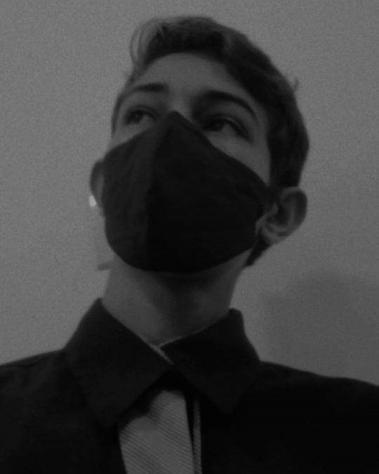

<h1 align="center"> Seja bem-vinda e bem-vindo! </h1> 

  

 

 
  <b>Apresentação 🎩🤵🏻</b>

 

<b>Josyel Buenos</b>, 17 anos.  
Programador e hacker ético, com foco em desenvolvimento de ferramentas e softwares voltados para Pentest e segurança da informação.  
Certificado em Python, JavaScript, HTML, C++, C#, Pentest básico e avançado, entre outras tecnologias.  
Criador do projeto Oráculo.
Membro ativo de comunidades de segurança da informação e desenvolvimento.  
Possui experiência em programação e hacking, além de interesse em idiomas, estoicismo, software cracking e hardware hacking.

### ✨ Curiosidades
- Fã de Harry Potter e MCU.  
- Apreciador de café.  
- Gosta de músicas clássicas e jazz.  
- Conhecido por trocadilhos e piadas ruins.  
- Comida preferida: Pudim e pão com manteiga na chapa.  

---

**Áreas de interesse e atuação:**  

- 👩‍💻 Segurança da informação:  
  - Desenvolvimento seguro  
  - Pentest em hardware e redes  
  - Pentest web  
  - Segurança em banco de dados  
  - Forense (básico / intermediário)  

- 👨‍💻 Programação:  
  - Python  
  - C#  
  - C++  
  - HTML + CSS + JS  
  - Ruby  
  - NodeJS  
  - NestJS  

- 👾 Hobbies:  
  - Estudo em segurança e OSINT  
  - Viagens  
  - Leitura  
  - Hardware Hacking  
  - Lockpick  
  - OSINT  
  - Jogar MTA  

---

- 💬 Aberto a colaborações e troca de conhecimento.  
- 📫 Contato: **josyelbuenos@gmail.com**  
- 💼 Apaixonado por tecnologia, sempre em busca de aprendizado e evolução na carreira.  

---

  

&nbsp;
  

**Linguagens e ferramentas:**  

 
 
 
 
 
 

 

  

⭐️ Baseado em [Hérika Ströngreen](https://github.com/Strongreen)
